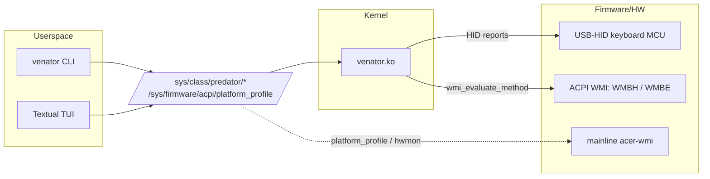

# Venator for Linux

A Linux replacement for Acer's Windows-only **PredatorSense** utility,
built for the **Acer Predator Helios 16 (PH16‑71)** and related Predator
laptops. It gives you full control of the per‑key RGB keyboard, the rear
lightbar, power/thermal profiles, and battery health — from a CLI, a
terminal UI, or systemd at login.

> **Status:** actively developed and daily‑driven on a PH16‑71.
> Keyboard RGB, rear lightbar, power profiles (with AC/battery policy &
> live switching), battery health limit, fans/thermals, profiles and
> boot‑restore all work today. See the [Roadmap](#roadmap) for what's next.

---

## Table of contents

- [Features](#features)
- [Supported hardware](#supported-hardware)
- [Requirements](#requirements)
- [Installation](#installation)
- [Usage](#usage)
  - [Terminal UI](#terminal-ui)
  - [Keyboard RGB](#keyboard-rgb)
  - [Designs, animations & per‑key paint](#designs-animations--per-key-paint)
  - [Rear lightbar](#rear-lightbar)
  - [Unified keyboard + lightbar](#unified-keyboard--lightbar)
  - [Power & thermal](#power--thermal)
  - [Battery health](#battery-health)
  - [Profiles & restore‑at‑login](#profiles--restore-at-login)
- [How it works](#how-it-works)
- [Project layout](#project-layout)
- [Roadmap](#roadmap)
- [Troubleshooting](#troubleshooting)
- [Contributing](#contributing)
- [Credits](#credits)
- [License](#license)

---

## Features

- **Per‑key RGB keyboard** — 13 named hardware effects (breathing, wave,
  rainbow, ripple, …), solid colours, brightness control, and a full
  384‑byte per‑key framebuffer for arbitrary layouts and images.
- **Designs & animations** — ship‑with presets plus a dead‑simple Python
  API for your own. Animations run as a detached background worker.
- **Per‑key painting by name** — paint `W,A,S,D` or `F1` directly once
  you've recorded a keymap.
- **Rear lightbar** — all firmware effect modes including the
  Wireshark‑recovered Static (Direct) mode, with colour/brightness/speed.
- **Unified mode** — drive keyboard *and* lightbar in lockstep from one
  theme or one synchronised animation.
- **Power & thermal** — switch platform profiles (Eco/Quiet/Balanced/
  Performance/Turbo), read live fan RPMs and CPU/GPU/chassis temps.
- **AC/battery power policy** — separate profile for plugged‑in vs
  on‑battery, **applied live the instant you plug/unplug**, restored at
  login. Battery is limited to low‑heat profiles unless you opt in.
- **Plays nice with other power managers** — detects and can detach
  `power-profiles-daemon`, `tuned`, `auto-cpufreq`, `system76-power`,
  and `tlp`.
- **Battery health** — 80 % charge cap and calibration cycle.
- **Restore at login** — your last keyboard + lightbar scheme and the
  right power profile come back automatically.
- **CLI + TUI, one brain** — the CLI and the Textual TUI drive the same
  logic; sysfs stays canonical.
- **Survives kernel upgrades** — a `kernel-install` hook (or akmods)
  rebuilds and re‑signs the module on every new kernel.

## Supported hardware

| Component        | Status | Notes |
|------------------|:------:|-------|
| Keyboard RGB     | ✅ | Chicony MCU `04F2:0117`, USB‑HID FF02 vendor interface |
| Rear lightbar    | ✅ | EC via `WMBH` AcerGamingFunction (method 20) |
| Power profiles   | ✅ | mainline `acer-wmi` `platform_profile` |
| Fans / temps     | ✅ | `acer` hwmon |
| Battery limit    | ✅ | our kernel module (`WMBE`), with mainline fallback |
| Per‑zone RGB     | 🚧 | works in Windows; no working Linux path found yet ([Roadmap](#roadmap)) |

Primary target is the **PH16‑71**. Other Predator/Helios models with the
same keyboard MCU and WMI GUIDs are likely to work — reports and PRs to
[`docs/MODELS.md`](docs/MODELS.md) welcome.

**Tested on:**

| Device   | OS        | Kernel                    | BIOS |
| -------- | --------- | ------------------------- | ---- |
| PH16‑71  | Fedora 43 | `7.0.9-105.fc43.x86_64`   | 1.16 |
| PH16‑71  | Fedora 43 | `7.0.10-101.fc43.x86_64`  | 1.16 |

## Requirements

- A recent kernel with `acer-wmi` (Fedora 43+ exposes `platform_profile`,
  fans, and temps out of the box).
- Kernel headers/`-devel` for your running kernel (to build the module).
- `python3` (stdlib only for the CLI).
- Optional: `python3-textual` for the TUI, `python3-pillow` for image
  painting.
- If **Secure Boot** is on, you'll enroll a signing key once (the
  installer walks you through it).

## Installation

```bash
git clone https://github.com/Exyons/Venator.git
cd Venator

# 1) Userspace: CLI, assets, udev rule, systemd units, modules-load.d
sudo make install

# 2) Kernel module — pick ONE:
sudo make hook-install      # Fedora, recommended: a kernel-install hook
                            # rebuilds + re-signs on every kernel upgrade
sudo make akmods-install    # Fedora alternative, via akmods.service
sudo make manual-install    # any distro; re-run after each kernel upgrade
```

`make install` also drops two **user** services and enables them for you:
`venator-restore` (restore at login) and
`venator-powerwatch` (live AC/battery profile switching). A
system `venator-perms` unit hands the relevant `/sys` entries to
the `predator` group so you don't need `sudo` for everyday use:

```bash
sudo usermod -aG predator,input "$USER"   # then log out / back in
```

**Secure Boot:** the installer auto‑detects an existing MOK/akmods key,
or generates one and prints the `mokutil --import` line. Enroll it and
reboot once. Full details in
[`packaging/fedora/README.md`](packaging/fedora/README.md) and
[`docs/INSTALL.md`](docs/INSTALL.md).

Uninstall with `sudo make uninstall` (per‑user data under
`~/.config/venator/` is left intact) or `sudo make purge` to also
remove it.

## Usage

### Terminal UI

```bash
venator tui
```

A [Textual](https://textual.textualize.io/) UI with a live keyboard
preview and tabs for **Home / Keyboard / Power / Battery / Lightbar /
Unified**. Every tab scrolls, the Power tab is split into power controls
(left) and live fans/temps (right). Works over SSH.

### Keyboard RGB

```bash
venator status                               # current state
venator rgb static '#ff0000'                 # solid red
venator rgb effect breathing --color '#00f'  # breathing blue
venator rgb effect rainbow                   # hardware palette
venator rgb fill '#ff00ff'                   # per-key buffer, all magenta
venator rgb off
venator brightness 200
venator effect-id 0x14                       # raw EFF byte override
```

High‑level `rgb` subcommands stage and `apply` in one go. Low‑level
`mode`/`color`/`brightness`/`effect-id` only stage — add `--apply` or run
`venator apply`.

### Designs, animations & per‑key paint

```bash
# One-shot static designs
venator rgb design --list
venator rgb design pride
venator rgb design gaming --brightness 200

# Continuous animations (detached background worker)
venator rgb animate --list
venator rgb animate rolling_rainbow
venator rgb animate fire --timeout 60        # auto-off after 60s

# Paint an image across the 128 cells (needs Pillow)
venator rgb image wallpaper.png

# Paint by key name. A full PH16-71 keymap is installed by `make
# install`, so this works out of the box; run `map discover` only if you
# want to re-record it for a different layout.
sudo venator rgb key F1 '#ff0000'
sudo venator rgb keys 'W,A,S,D' '#00ff00'
sudo venator map discover                    # optional: re-record
```

While an animation is running, the keyboard's Fn brightness up/down keys
dim/brighten it live (the MCU ignores those keys in per-key mode, so the
animator watches for them and adjusts brightness itself).

Write your own animation (`render(t, num_cells, keymap) -> bytes`) or
design and drop it in `~/.config/venator/{animations,designs}/`.
See [`cli/animations/README.md`](cli/animations/README.md) and
[`cli/designs/README.md`](cli/designs/README.md).

### Rear lightbar

```bash
venator lightbar status
venator lightbar modes                       # list effect modes
venator lightbar set static '#00ffcc' --brightness 150
venator lightbar mode breathing
venator lightbar off
venator lightbar wake                         # recover a stuck-off bar
```

### Unified keyboard + lightbar

```bash
venator unified list                          # themes
venator unified apply ocean
venator unified anim list                     # synchronised animations
venator unified anim rainbow_sync
venator unified anim dawn --timeout 120
```

### Power & thermal

```bash
venator power                                 # current + choices + active managers
venator power turbo                           # Eco/Quiet/Balanced/Performance/Turbo
venator thermal                               # fan RPMs + CPU/GPU/chassis temps

# AC vs battery policy — applied at login AND live on plug/unplug.
# First-use defaults: Balanced on AC, Quiet on battery.
venator power-policy                           # show policy + power source
venator power-policy ac performance
venator power-policy battery balanced
venator power-policy battery turbo --advanced  # high power on battery (warns)

# Other power managers (PPD, tuned, auto-cpufreq, system76-power, tlp)
# fight us for platform_profile. Detach/restore them all at once:
venator power --detach-ppd
venator power --attach-ppd
```

The `venator-powerwatch` service applies the matching profile the
moment you plug or unplug — no need to wait for the next login.

### Battery health

```bash
venator battery info
venator battery limit 80          # cap charge at 80% (extends pack life)
venator battery limit off         # back to 100%
```

### Profiles & restore‑at‑login

Every `rgb` and lightbar command auto‑snapshots a `default` profile
(including a running animation). The `venator-restore` user
service replays it — keyboard, lightbar, **and** the power profile for
the current power source — at every login.

```bash
venator profile save my-setup
venator profile load my-setup
venator profile list
```

## How it works



On the PH16‑71 the **keyboard LEDs hang off the keyboard MCU**
(`04F2:0117`, Chicony) and are driven over USB‑HID, *not* the EC/WMI RGB
path that the community modules (`Linuwu-Sense`,
`acer-predator-turbo-and-rgb-keyboard-linux-module`) assume — which is
why those load cleanly but light nothing on this chassis. Commands are
8‑byte HID feature reports; per‑key frames are 8×64‑byte interrupt‑OUT
bursts (128 cells × `{0x00,R,G,B}`). The **rear lightbar** uses the EC
via the `WMBH` WMI method, and **battery** via `WMBE`. The userspace
sysfs ABI is documented in [`docs/sysfs.md`](docs/sysfs.md).

## Project layout

```
kernel/          out-of-tree module (HID + WMBH/WMBE) + DKMS config
cli/             venator — the CLI (stdlib Python); designs/, animations/, keymaps/
gui/             Textual TUI (tui.py) + shared client library (client.py)
systemd/         restore-at-login, powerwatch, and perms units
udev/            group-based sysfs permissions
modules-load.d/  auto-load the module at boot
packaging/fedora hook / akmods installer + RPM spec
docs/            sysfs.md, INSTALL.md, MODELS.md
```

## Roadmap

Planned / wanted — contributions very welcome:

1. **Custom boot logo** — replace the BIOS splash image.
2. **USB powered‑off charging** — toggle charging the USB‑A port while
   the laptop is asleep/off.
3. **Per‑zone RGB control** — works in Windows but no working Linux WMI
   path has been found on the PH16‑71 yet.
4. **Hosted documentation wiki** — move the deep docs to a browsable web
   wiki.

Also on the list: broader **model coverage**.

## Troubleshooting

- **Module loads but keyboard stays dark:** make sure `wmbh_probe` isn't
  holding the WMI GUID (`sudo rmmod wmbh_probe`) and that you're on a
  PH16‑71‑class board.
- **`Key was rejected by service` on load:** Secure Boot — enroll the
  signing cert: `sudo mokutil --import /etc/pki/akmods/certs/*.der`,
  reboot, choose *Enroll MOK*.
- **Power profile keeps reverting on plug/unplug:** another power manager
  is active. Run `venator power` to see which, then
  `venator power --detach-ppd`.
- **Hook built nothing after a kernel upgrade:** install matching
  `kernel-devel` and check `journalctl -t venator-hook -b`.

## Contributing

Issues and PRs welcome — especially keymaps for new models, additional
designs/animations, and anything on the [Roadmap](#roadmap). The kernel
module is **GPL‑2.0**, so kernel contributions must be GPL‑2.0
compatible. Keep the CLI dependency‑free (stdlib only) so it runs
anywhere.

## Credits

- The Acer Linux community, including
  [Linuwu‑Sense](https://github.com/0x7375646F/Linuwu-Sense) and
  [acer‑predator‑turbo‑and‑rgb‑keyboard‑linux‑module](https://github.com/JafarAkhondali/acer-predator-turbo-and-rgb-keyboard-linux-module),
  for prior reverse‑engineering of the WMI paths.
- [OpenRGB](https://openrgb.org/) — the SDK capture that revealed the
  lightbar's Static (Direct) mode.

## License

GPL‑2.0‑only. See [`LICENSE`](LICENSE).

> **Disclaimer:** this is an unofficial project, not affiliated with or
> endorsed by Acer. It writes to embedded‑controller / WMI interfaces;
> use at your own risk. Every command corresponds to a method or HID
> report observed on real hardware, but firmware varies between models
> and BIOS revisions.
